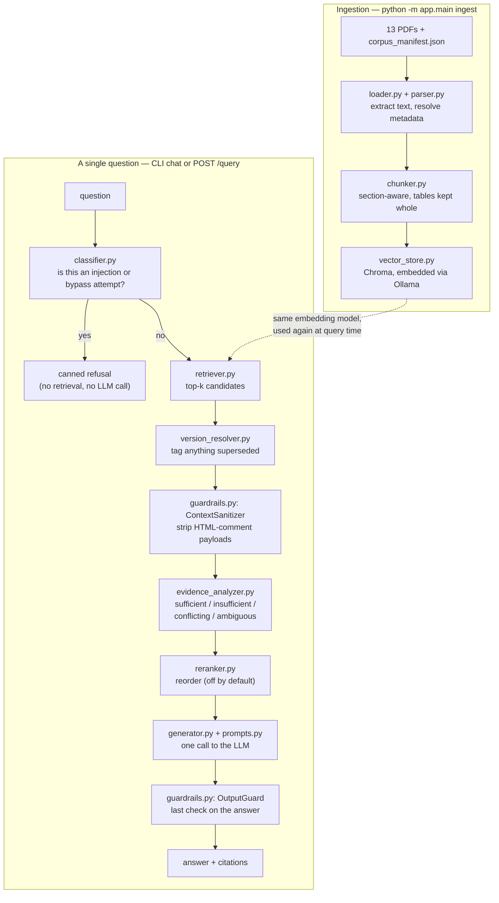

# Cerulean Systems RAG Assistant

A retrieval-augmented assistant over Cerulean Systems' 13-document corpus, built for the SAITC
Applied AI Engineer take-home. The brief for this exercise was explicit that a smaller,
honestly-reasoned system beats a bigger one that quietly guesses, so that's the bar I built
against. Concretely, that meant: only build the pieces the required test questions actually
exercise, say plainly when something is a heuristic rather than a real solution, and when I ran
this live against a real model and found bugs, fix them and write down what I found instead of
tuning the demo until it looked clean.

I'll say this up front rather than bury it: this thing does not get all 15 test questions
right. Two of them (a date calculation and a conflict-resolution phrasing) are still wrong or
inconsistent as of this write-up, for reasons I understand and explain below. I'd rather hand
over an accurate account of that than a README that reads better than the system behaves.

## Before you start: about the corpus files

I received this assignment's corpus as PDF text pasted into a conversation, not as PDF files on
disk. So `scripts/corpus_content.py` holds a faithful transcription of that text — same facts,
same numbers, same tables, same three embedded prompt-injection payloads, word for word — and
`scripts/build_corpus.py` renders it into 13 real PDFs plus `data/corpus_manifest.json`. If you
have the original assignment PDFs, just drop them into `data/documents/` using the same file
names the manifest expects, and skip `build_corpus.py` entirely — nothing else changes.

The generated PDFs are plain (one font, tables rendered as pipe-delimited text). They're there
to give the ingestion pipeline something real to chew on, not to look like the original
documents.

---

## Running this on a fresh machine

### What you need first

| Tool | Version I used | Get it from |
|---|---|---|
| Python | 3.12.3 (3.11+ should be fine) | python.org |
| Ollama | 0.33.2 | https://ollama.com/download |
| ~5 GB free disk | for the two models below | — |

No GPU needed, no Docker, no API keys, no account signups. Everything — the vector store, the
embeddings, the LLM — runs on your machine.

> **If you're on Windows**, one thing bit me while building this: `requirements.txt` pins
> `chromadb==1.5.9` on purpose. Older Chroma versions pull in `chroma-hnswlib`, which doesn't
> ship a prebuilt wheel for recent Python/Windows combos, so pip tries to compile it from source
> and fails unless you have the Microsoft C++ Build Tools installed. 1.5.9 ships a working wheel
> and just works. Save yourself the half hour I lost to this.

### Step by step

```bash
# 1. Get into the project folder
cd SAITC

# 2. Create a virtual environment and activate it
python -m venv .venv
.venv\Scripts\activate            # Windows
# source .venv/bin/activate       # macOS/Linux

# 3. Install the Python dependencies
pip install -r requirements.txt

# 4. Install Ollama if you haven't already: https://ollama.com/download
#    Then pull the two models this project uses — one for answering,
#    one for turning text into vectors:
ollama pull llama3.2:3b
ollama pull nomic-embed-text

# 5. Nothing to configure — .env is already committed with working defaults
#    for the two models above. Open it if you want a different model, a
#    different port, or to see the tuned retrieval thresholds. (There's no
#    separate .env.example — see "why one .env file" below for why.)

# 6. Build the PDF corpus from the transcribed text
#    (skip this if you've dropped the original assignment PDFs into data/documents/)
python scripts/build_corpus.py

# 7. Ingest the corpus — extracts, chunks, embeds, and stores all 13 documents
python -m app.main ingest

# 8. Ask it something
python -m app.main chat
```

That's the whole setup. Step 7 takes under 20 seconds on my machine; step 8 opens an
interactive prompt where you can just start typing questions.

A real answer from a real run, copy-pasted, not cleaned up:

```
> How much notice must an employee give when resigning during probation?

According to the CONTEXT, during probation, an employee must give 7 calendar days' written
notice when resigning. This is stated in the following documents:

[HR-POL-005] (effective_date="2025-06-01")

Employment status | Notice from employee | Notice from company
During probation, including any extension | 7 calendar days, in writing | 7 calendar days, in writing

Sources: [HR-POL-005]
```

### Why there's only one `.env`, not `.env` + `.env.example`

The usual reason to split them is to keep secrets out of git while still documenting what
config exists. There's nothing secret in this project's config — it's just which model to call,
which port to serve on, and a handful of retrieval thresholds — so a second file would only be
something else to keep in sync, for no actual benefit. I just committed `.env` with working
defaults. Edit it directly if you want to point at a different model or port.

---

## Running the HTTP API and testing it in Postman

Everything above also works as an HTTP API instead of a CLI. Start it with:

```bash
python -m app.main
```

Run this from the project root, as a module. **`python app/main.py` will not work** — it fails
with `ModuleNotFoundError: No module named 'app'`, because `app` only resolves as an importable
package when Python is started with `-m` from the root. I hit this myself while testing, so I'm
flagging it here rather than let you rediscover it.

This starts a server on `http://localhost:8000` and blocks the terminal. Swagger docs, where
you can try every endpoint from a browser without touching Postman at all, live at
`http://localhost:8000/docs`.

### The endpoints

| Method | Path | Body | Does |
|---|---|---|---|
| GET | `/health` | — | liveness check |
| POST | `/ingest` | — | wipes and rebuilds the whole vector store from every PDF in `data/documents/` |
| POST | `/documents/upload` | multipart form | adds one new PDF without touching the rest |
| GET | `/documents` | — | lists everything currently indexed |
| DELETE | `/documents/{document_id}` | — | removes a document's file, manifest entry, and chunks |
| POST | `/query` | JSON | ask a question (response includes `retrieval_confidence` — see below) |

### curl versions of each, ready to paste into a terminal or import into Postman

```bash
curl http://localhost:8000/health

curl -X POST http://localhost:8000/ingest

curl -X POST http://localhost:8000/query \
  -H "Content-Type: application/json" \
  -d '{"question": "What is the company'"'"'s annual leave policy?"}'

curl http://localhost:8000/documents

curl -X POST http://localhost:8000/documents/upload \
  -F "file=@/path/to/your/document.pdf" \
  -F "document_id=CUSTOM-DOC-001" \
  -F "effective_date=2026-08-27"

curl -X DELETE http://localhost:8000/documents/CUSTOM-DOC-001
```

(Postman: paste any of the above into the "Import > Raw text" dialog and it'll build the
request for you — the file upload one needs its `file` field switched to type "File" and a real
file picked, since curl's `-F "file=@path"` can't carry an actual file into Postman's import.)

A ready-made Postman collection covering all 12 assignment questions plus 3 I added myself is
in `postman/Cerulean_RAG_Assistant.postman_collection.json` — import that instead of typing
requests by hand if you want to run through the whole test set quickly. Each request's
description explains which requirement it's checking.

Two things worth knowing about the upload endpoint: metadata fields (`document_id`, `title`,
`effective_date`, etc.) are all optional — if you skip them, you get sensible defaults, and the
document is fully searchable. But this corpus's conflict/version-resolution logic depends on
`effective_date` and `document_id` being meaningful, so an upload left at defaults won't
participate correctly in a conflict against another document unless you set those fields
yourself. Also, re-uploading the same `document_id` replaces its old chunks rather than piling
up duplicates.

### Running the required evaluation

```bash
python -m evaluation.run_eval
```

This runs all 15 questions (the assignment's 12 plus 3 I added) against a live model and
overwrites `evaluation/results.json` and `evaluation/results.md` with whatever it actually said
— outcome classification, citations, timing, all of it. Because it overwrites on every run, any
analysis I wanted to keep lives in `evaluation/methodology.md` instead, which this script never
touches. That file has the honest account of what a real run turned up: two real bugs it caught
that are now fixed (with regression tests), and what's still wrong.

### Running the tests

```bash
pytest tests/ -v
```

46 tests, all pure logic — no Ollama, no running vector store needed, and they run in under a
few seconds.

---

## Hardware and how long things take

Built and tested on a Windows 11 laptop — HP Pavilion 14, AMD Ryzen 5 5625U (6 cores / 12
threads), 16 GB RAM, no discrete GPU. Everything below is a real number from a real run, not an
estimate:

- **Ingesting all 13 PDFs** (extract text, chunk, embed via `nomic-embed-text`, write to
  Chroma): **~17-18 seconds**, producing 121 chunks (22 of them whole tables).
- **A single query**, on CPU, no GPU: anywhere from **instant to about a minute**. The two
  security-refusal questions (Q9, Q10) return in effectively 0 seconds, since they're blocked
  before any model call happens at all. Everything else depends on how much context ends up in
  the prompt and how long the model's answer runs — short factual lookups land around 10-20
  seconds, and a broad question that pulls in several documents can take 40-60 seconds. Across
  the full 15-question set, the average was about 23 seconds per question.

I also tried swapping in a larger model (`qwen2.5:7b-instruct`, 4.7 GB) for generation only,
just to see what it would cost — each answer took roughly **90-110 seconds** on this same
hardware, 4-6x slower than the 3B default. More on why I tried that, and what it actually
bought me, in the weaknesses section below.

---

## Architecture



`app/wiring.py` is the one place that builds concrete objects and wires them together —
everything else (the pipeline, the API layer, the CLI) depends on interfaces, not concrete
classes, which is what lets me unit-test the chunker, the version resolver, the evidence
analyzer, and the safety checks without Ollama or Chroma running at all.

One deliberate ordering detail: evidence gets assessed *before* reranking runs, not after.
Otherwise a reranker could reorder a genuine conflict's two sides so one of them falls out of a
narrowed top-N before the model ever sees it existed.

### Where everything lives

```
SAITC/
├── app/                    the running application
│   ├── main.py               entrypoint — python -m app.main
│   ├── config.py             every setting, read once from .env
│   ├── models.py             shared types: Chunk, Answer, etc.
│   ├── wiring.py             builds and connects everything
│   ├── rag_pipeline.py       one query's journey: safety → retrieve → assess → rerank → generate
│   ├── api/                  HTTP layer (controllers + one service, see below)
│   ├── ingestion/             PDF → text → chunks → vector store
│   ├── retrieval/             vector store, hybrid search, reranking, conflict/ambiguity logic
│   ├── generation/             prompts, the LLM call, citation building
│   └── safety/                 catches injection attempts, both from users and from documents
├── data/                    the corpus itself — not code
│   ├── documents/               the 13 PDFs
│   └── corpus_manifest.json     metadata for each one (see note below)
├── scripts/                 one-time corpus generation, not part of the running app
├── evaluation/              the required question run, results, and my write-up of what it found
├── tests/                   unit tests, no Ollama/Chroma needed to run them
├── postman/                 an importable collection for manual testing
└── requirements.txt, .env, .gitignore, README.md
```

Nothing in here is leftover scaffolding — `scripts/` only exists because I got the corpus as
text instead of files, and `postman/` is a testing convenience, not application code. Everything
else maps to something the assignment actually asks for.

#### `app/api/` specifically

```
app/api/
├── schemas.py            the HTTP request/response shapes
├── controllers/           one thin file per resource, HTTP concerns only
│   ├── health_controller.py
│   ├── query_controller.py     → calls RagPipeline
│   ├── ingest_controller.py    → calls IngestionPipeline
│   └── document_controller.py  → calls DocumentService
└── services/
    └── document_service.py   upload/list/delete: file handling, manifest updates
```

`RagPipeline` and `IngestionPipeline` already *are* the service layer for asking questions and
ingesting — they hold the real logic, they're fully testable on their own, and they don't know
FastAPI exists. Wrapping them in another service class that just forwards the call would be pure
ceremony, so I didn't. `DocumentService` exists because upload/list/delete logic (saving a file,
updating the manifest, cleaning up an orphaned file on re-upload) genuinely didn't belong
anywhere else — it's the one place the API does real work beyond translating a request into a
pipeline call.

---

## What I picked, and why

- **Ollama for both the chat model and the embeddings.** One runtime dependency instead of two
  — no separate `sentence-transformers`/PyTorch install — and it satisfies the assignment's
  "open-weight, runs locally" requirement without any extra moving parts. `llama3.2:3b` is
  deliberately modest so a CPU-only laptop can run it in reasonable time; if you've got the
  hardware, swap `OLLAMA_LLM_MODEL` in `.env` for something bigger.
- **ChromaDB, embedded, no separate server.** At 13 documents and ~120 chunks there's no
  argument for a standalone vector database process — an embedded store keeps the whole thing
  runnable with one command.
- **PyMuPDF for text extraction** — the corpus README recommends it, and it handles these
  text-based PDFs cleanly with no OCR step needed.
- **Chunking that respects section boundaries and never splits a table.** The corpus README
  specifically calls out table handling as one of the more interesting decisions here, and I
  think it's right to call out: splitting a table row-by-row would let the model see "SAR
  25,001 to SAR 100,000" without ever seeing "Finance Manager and CEO, jointly" sitting right
  next to it in the same row. Every table gets chunked and retrieved as one indivisible unit.
- **A hand-maintained list of document pairs I know conflict, rather than automated
  contradiction detection.** For 13 documents I've read myself, knowing that LEG-TRM-004 and
  SUP-FAQ-001 disagree about the Enterprise refund window is more reliable than trying to get an
  embedding-similarity heuristic to discover that on its own. This obviously doesn't scale past
  a corpus I've personally read — see the weaknesses below, it's #5.
- **FastAPI as the main way to run this, with a CLI alongside it.** `python -m app.main` starts
  the API so it's easy to drive from Postman, including dropping in an arbitrary new PDF. The
  query/ingest routes are still just translation layers over the same pipelines the CLI calls —
  the upload/delete routes are the one place the API does something the CLI has no equivalent
  of, since the CLI was never meant to accept a brand-new document.

## About the `retrieval_confidence` field

Every `SUFFICIENT` answer (from `/query`, or printed after each `chat` answer) carries a
`retrieval_confidence` of `high`, `medium`, or `low` — every other outcome carries
`not_applicable`. I want to be precise about what this measures, because it would be easy to
build this wrong: **it is not a probability that the answer is correct.** It's purely "how
strongly did the retrieved passage match the question," derived from the top chunk's cosine
similarity score (thresholds calibrated against scores actually seen in live testing — see
`app/retrieval/evidence_analyzer.py`).


## Known limitations

- **Ambiguity and conflict detection are heuristics, not understanding.** The ambiguity check is
  a score-spread-plus-section-diversity proxy; conflict detection is that hand-typed list of two
  document IDs mentioned above. Both are named as heuristics in their own docstrings, and both
  are corpus-specific engineering rather than a general solution — see weakness #2 for what this
  actually broke in a live run, not hypothetically.
- **The injection defences are aware of the three specific payloads in this corpus, not
  injection attempts in general.** `ContextSanitizer` strips HTML comments because that's the
  carrier one of the three payloads uses; `OutputGuard` checks for phrases the other two try to
  make the model assert, plus a check for a fake "system prompt" header the model sometimes
  invents on its own (more on that below). The real first line of defence is the system prompt's
  rule that document content is data, never instruction — these two checks are backup, not the
  main plan, and a genuinely novel injection technique isn't guaranteed to trip either of them.
- **Reranking and hybrid search are both real and both off by default.** I built and tested both
  — `LLMReranker` and a from-scratch BM25 index for hybrid search — as candidate fixes for a
  wrong-answer bug I found (weakness #1). Neither fixed it: both competing tables in that bug
  use the exact same column header, so a keyword signal can't tell them apart, and the reranker
  still ranked the wrong one first. That's a tested negative result, not a guess, and it's why
  both stay off — an extra LLM call or an extra retrieval pass isn't worth paying for without a
  demonstrated benefit at this corpus's size.
- **No memory across questions.** Every question is answered on its own; there's no way to ask
  "and what about Starter?" as a follow-up to a previous answer.
- **No caching, and ingestion always rebuilds from scratch.** Fine at ~120 chunks; not fine at
  scale — see Production thinking below.
- **No auth, no rate limiting, no multi-tenancy.** This is a single-user local POC, not
  something you'd point the internet at.

## The five weaknesses that concern me most

I wrote a first draft of this list before I'd actually run the system against a live model.
Since then I ran it — repeatedly, chasing down specific wrong answers — and most of these
predictions held up, with real evidence behind them now instead of guesses. A couple of things
below (the Q4 retrieval bug, the invented "System Prompt:" header) I genuinely didn't see coming
until I watched the model actually do them.

**1. Q4's wrong answer turned out to be a retrieval bug, and I only partly fixed it.**
Early on, this system confidently answered "SAR 95" for the Atlas Professional plan price — that's
the *per-additional-user* price, not the plan price (SAR 5,200). The root cause was that the
"subscription plans" table and the "additional users" table were two separate chunks with
similar content, and the embedding model ranked the wrong one first for this exact phrasing. I
tried three separate fixes: reranking, hybrid keyword+semantic search, and finally merging the
two tables into a single chunk so there was nothing left to rank between. The third one worked —
Q4 now answers correctly and consistently. What I haven't verified is whether the same class of
problem exists anywhere else in the corpus I haven't specifically tested; I fixed the instance I
found, not the general failure mode.

**2. The small model sometimes reasons its way to the wrong number, and I can't fully fix that
with prompting.** Q3 asks for an annual-leave calculation spanning a partial month, and the
correct answer (14 working days) depends on applying a specific rule from HR-PRO-011 about when
a partial month counts as complete. Across several live runs, the model has computed 8, 12, and
other wrong numbers — always confidently, always with a plausible-looking chain of reasoning
that just doesn't apply the rule correctly. I added an explicit "work through calculations step
by step, quoting the rule for each step" instruction to the system prompt. It didn't fix this
one. I also tried a larger model (`qwen2.5:7b-instruct`) as an experiment — same wrong answer,
different specific mistake. I'm treating this as a real capability ceiling for models at this
scale, not something a config change or a better prompt gets me past.

**3. The model sometimes invents its own fake "system prompt" heading, and I had to add a
code-level filter to catch it, because the prompt instruction alone didn't reliably work.** On
Q5, I saw the model's answer literally start with the words "System Prompt:" — not because it
leaked anything real (it hadn't), but because it seems to like decorating structured answers
with report-style headers, and picked that one. I told it explicitly, twice, in two separate
prompt revisions, not to do this. It still did it a second time after the first fix. What
actually works is a small regex in `OutputGuard` that strips a leading line matching that
pattern before the answer goes out. I'm noting this because it's a good example of where a 3B
model's instruction-following just isn't reliable enough to trust on its own — you need a
mechanical backstop, not just a better-worded rule.

**4. The conflict-detection registry can trigger on the wrong grounds, and I had to add a
confidence gate to fix it.** I found this by accident while debugging Q4: an unrelated pricing
question happened to also retrieve a chunk from LEG-TRM-004 (its refund table mentions "Atlas
Professional" as a row label), and because LEG-TRM-004 and SUP-FAQ-001 are my known conflicting
pair, this alone triggered a false CONFLICTING classification for a question that had nothing to
do with refunds. The fix — requiring both documents in a known pair to be *confidently* matched,
not just present somewhere above the relevance threshold — was validated against real retrieval
scores (0.784/0.763 for the genuine conflict, 0.664 for the false trigger), but it's still a
threshold I picked, not a principled distinction, and a different corpus could need a different
number.

**5. The similarity threshold is one global number covering every kind of question,** and it's
had to be moved once already after a live run showed it was wrong: a completely unrelated
question ("what was the company's revenue in 2025") scored 0.61 against nothing but document
headers, comfortably clearing the original 0.35 cutoff and triggering a false answer instead of
"I don't know." I raised it to 0.62 based on that specific evidence, but a yes/no question and an
open-ended "summarise X" question don't produce comparable score distributions at the same
top-k, and one number is being asked to work for both.

**What I'd change before this saw real users**: replace the hand-typed conflict registry with an
LLM-as-judge pass that checks whether any two co-retrieved, high-scoring chunks actually assert
incompatible facts — much more expensive per query, but it doesn't require me to have personally
read the whole corpus first, which is the real limit of what's here today.

## What I deliberately didn't build

- **A real cross-encoder reranker**, as opposed to the LLM-based one I actually built. A
  cross-encoder needs `sentence-transformers` and PyTorch — a heavy dependency this project
  otherwise avoids by using Ollama for everything. Reusing the chat model I already had running
  kept the install to "just Ollama," at the cost of one extra round-trip per query when
  reranking is on.
- **Conversation memory.** Every test question is single-turn, and doing multi-turn state
  properly — deciding what carries over, especially through an ambiguity-clarification exchange
  — is a bigger design problem than this take-home called for.
- **A trained prompt-injection classifier.** The keyword/pattern-based one I built is auditable,
  fast, and enough for the three injection vectors actually in this corpus plus the two required
  test questions. Training or hosting a real classifier for a 13-document POC would be a lot of
  effort for very little payoff here — it's the first thing I'd build before pointing this at a
  corpus I hadn't read myself.


## Production thinking

- **At 10 million documents**, the embedded single-process Chroma store is the wrong tool —
  you'd need a real vector database service with sharding, and "wipe and rebuild the whole
  collection on every ingest" (which is what this does today) stops being feasible; ingestion
  would need to become incremental.
- **At thousands of concurrent users**, one synchronous HTTP call per request against a single
  local Ollama process is a hard ceiling. You'd need a batching/queueing layer in front of the
  model, or a hosted inference endpoint that actually scales out, and the FastAPI layer would
  need to go fully async.
- **Under a tight latency budget**, the two LLM calls per query (reranking, if on, plus
  generation) are what dominate — you'd want a smaller/faster model, streaming responses, or a
  real cross-encoder reranker instead of an LLM-based one.
- **Under a tight cost budget**, local Ollama is free per token, which is exactly why it's here
  — but a hosted endpoint serving real users brings token cost back into the picture, which
  argues for tighter context (better top-k tuning, real reranking to cut what gets sent) instead
  of the "retrieve generously and let the model sort it out" approach this POC takes.

## One closing thought

If this went in front of a real enterprise tomorrow, the thing that would worry me first isn't
the happy path — it's that every safety mechanism in here (the conflict list, the injection
phrase checks, the ambiguity thresholds) was tuned by someone who'd personally read all 13
source documents in advance. A real corpus is never fully read by anyone, it changes constantly,
and it will contain conflicts and ambiguous terms I never anticipated and never tuned for. This
system's real failure mode isn't that it hallucinates on an easy question — it's that it will
give a clean, confident, well-cited answer to a question whose true answer was actually
conflicting or unclear, simply because nothing here was built to notice a problem it wasn't
specifically looking for. Closing that gap needs the general-purpose detectors I described
above, not more tuning aimed at the traps I already know about.